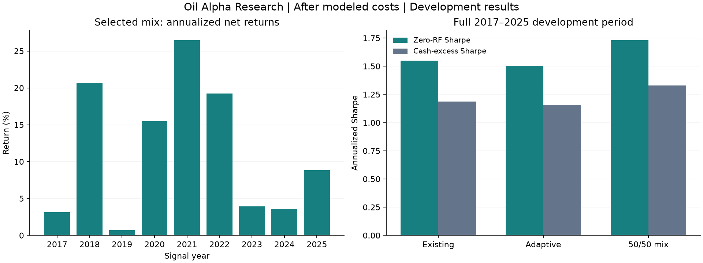
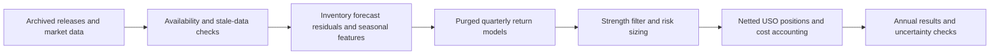

# Oil Alpha Research


Python research project testing whether inventory surprises, macroeconomic vintages and market signals help forecast oil ETF returns. It combines archived releases with chronological model fitting, conservative information timing and a long/short portfolio simulator.

The latest fixed blend produced **1.73 annualized Sharpe using a zero risk-free benchmark**, **11.0% CAGR** and **8.4% maximum drawdown** over **2017–2025**, after modeled transaction, borrowing and financing costs. These are **selected development-backtest results**, not independent validation or live performance. The corresponding cash-excess Sharpe is **1.33**.

[Results and annual breakdown](docs/RESULTS.md) · [Methodology](docs/RESEARCH_DESIGN.md) · [Reproduction guide](docs/REPRODUCING.md) · [Data sources](docs/DATA.md)



## What the project implements

- **Release-aware data engineering:** 744 retained archived EIA weekly releases, ALFRED yield-curve vintages, archived EIA STEO data, and sparse timestamped OilPrice headlines. Publication cutoffs, stale-data rules and release checksums preserve an auditable information set.
- **Two-stage forecasting:** ridge models predict inventory changes; standardized forecast residuals become inventory-surprise features. Return models combine these with seasonal flow anomalies, scarcity/demand states and 1/2/4/8-release lags.
- **Time-series validation:** quarterly expanding-window ridge, histogram gradient boosting and recency-weighted adaptive ridge; training-only preprocessing and horizon-specific label purging for 5/21-session forecasts.
- **Portfolio simulation:** next-open execution convention, weekly inventory decisions, volatility sizing, forecast-strength filters, a 2× signed target limit, drift-aware turnover, position netting, terminal liquidation and cost stress tests.
- **Research audit:** predefined experiment plans, source/input fingerprints, regression controls, annual comparisons and paired block-bootstrap diagnostics. Negative experiments remain visible.



## Selected results

| Portfolio, 2017–2025 | Sharpe, zero RF | Cash-excess Sharpe | CAGR | Max drawdown |
|---|---:|---:|---:|---:|
| Existing 21-session ridge portfolio | 1.551 | 1.185 | 10.7% | −9.0% |
| Adaptive 5-session ridge portfolio | 1.505 | 1.159 | 11.0% | −7.9% |
| **50/50 portfolio mix** | **1.731** | **1.330** | **11.0%** | **−8.4%** |

The two portfolios share macro/news and technical components. The final mix is equivalent to 37.5% macro/news, 25% technical, 18.75% existing inventory and 18.75% adaptive inventory strategy allocations. These percentages weight strategy target positions; they are not constant USO holdings. All components trade the same ETF.

Primary costs are **5 bps per traded dollar**, **3% annual short borrow**, and the cash proxy plus **2% annual spread** for leveraged-long financing; short collateral earns no rebate. Zero-RF Sharpe does **not** mean costs or cash income were removed from the ledger. See [metric definitions](docs/RESEARCH_DESIGN.md#metrics-and-costs).

Scarcity/demand additions and boosted trees did not improve the existing control. All six time-series model configurations had worse normalized-return RMSE than a zero forecast on common dates. The blend improvement's descriptive bootstrap interval includes zero. [Full comparison](docs/RESULTS.md).

## Quick start

Python 3.11+; development checks were run on Python 3.13. No paid subscription or GPU is required.

```bash
python3 -m venv .venv
source .venv/bin/activate
python -m pip install -e '.[dev]'
python -m pytest -q
python scripts/verify_repository.py
```

Tests use synthetic fixtures and require no downloaded market data. Published aggregate results are available immediately in [reports/](reports/README.md).

To run the original baseline with freshly downloaded public data:

```bash
python -m oil_research.cli download
python -m oil_research.cli run --period development
```

This runs the **original baseline**, not the final multi-stage blend. See [the reproduction guide](docs/REPRODUCING.md) for the expanded dependency chain, immutable output conventions and historical snapshot limitations. Fresh provider downloads may differ from the original run. Raw data, headline text, predictions and daily ledgers are deliberately excluded from Git.

## Repository map

| Path | Purpose |
|---|---|
| `oil_research/data.py`, `*_sources.py` | Public-source collection, caches and provenance |
| `weekly_features.py`, `refinement.py` | Seasonal features and inventory forecast residuals |
| `scarcity.py`, `time_series.py` | Scarcity experiments, release lags and return models |
| `backtest.py`, `extension_leverage.py` | Accounting, costs and signed exposure |
| `diversification.py`, `adaptive_blend.py` | Signal mixing and netted portfolio evaluation |
| `tests/` | Timing, feature-causality, execution and accounting checks |
| `docs/` | Design, frozen experiment plans and interpretation |
| `reports/` | Curated aggregate results and provenance manifests |
| `scripts/` | Export and repository-validation utilities |

## Interpretation

2017–2025 has been repeatedly used for development and selection, including an earlier baseline's 2024–2025 holdout. It is **not an untouched test set**. The project has not evaluated 2026 returns. Market prices are retrospectively adjusted vendor histories; news coverage is sparse, CFTC historical classifications are provisional, and actual borrow availability and intraday margin events are unverified. The technical component traded only during 2020–2021 in this sample, so low correlation partly reflects inactivity.

This repository documents a research process and its limitations. There is no live-trading integration. Source/data use and redistribution notes are in [DATA.md](docs/DATA.md).
